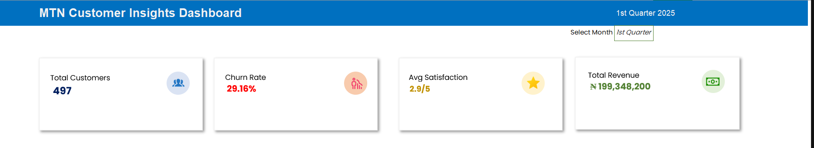
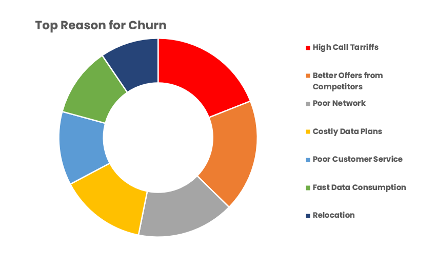
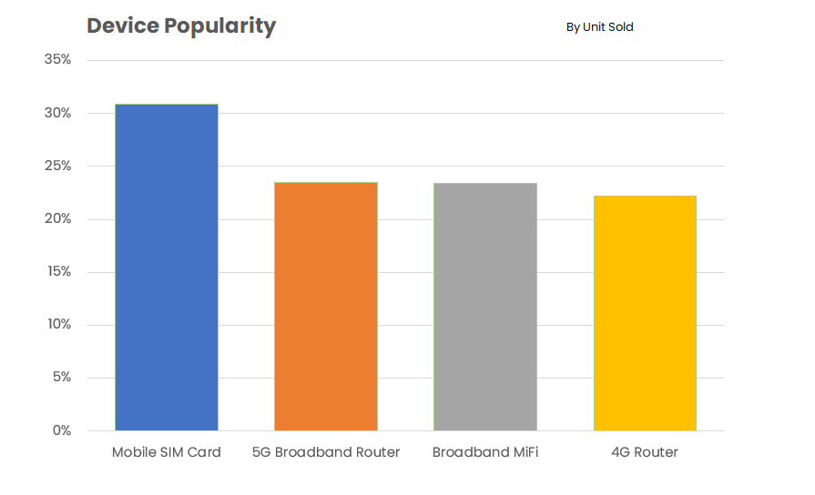
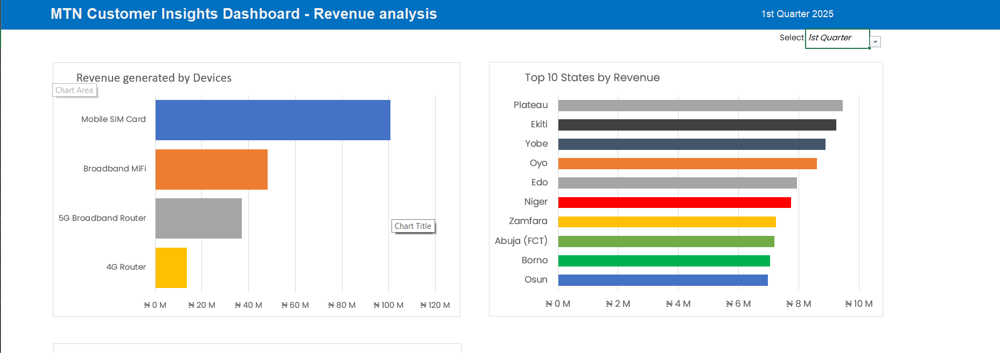
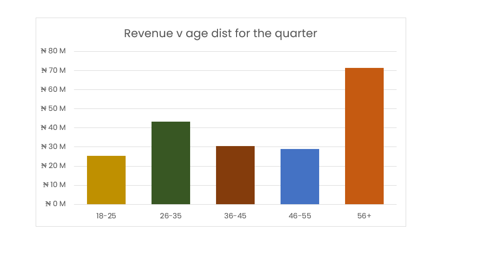
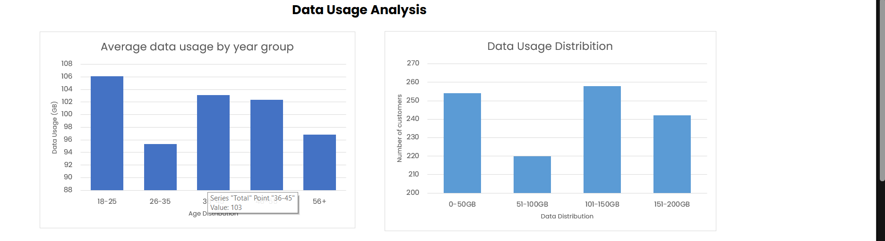
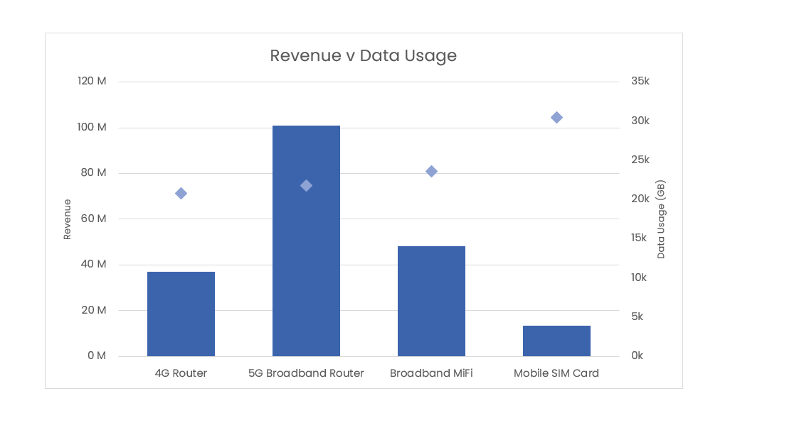

# MTN Insights Data Analysis Project

## Overview

This project involved analyzing the MTN Insights data using Microsoft Excel to derive meaningful insights and present them effectively through dashboards and visual presentations. The analysis aimed to highlight key performance indicators (KPIs), customer behavior trends, and device popularity metrics.

---

## Features and Deliverables

### 1. **Dashboard Creation**

A dynamic dashboard was developed to provide a high-level overview of critical metrics. Key features include:

* **KPI Cards:**

  * **Total Customers:** Displayed the total number of customers for the selected period.
  * **Average Satisfaction:** Calculated and displayed the average customer satisfaction score.
  * **Churn Rate:** Showed the percentage of customers who churned during the selected period.
  * **Total Revenue:** Summed up the total revenue for the selected period.

  

* **Visual Design:**

  * Used Excel illustrations such as rectangles and text boxes to create visually appealing KPI cards.
  * Ensured a clean and professional layout that enhances readability and engagement.

* **Month Filter:**

  * Implemented a drop-down menu to allow users to select a specific month.
  * Dynamically updated the dashboard to reflect data for the chosen month.

---

### 2. **Churn Analysis Presentation**

* Identified and analyzed the top reasons why customers churned.
* Summarized findings in a presentation format to effectively communicate insights.



---

### 3. **Device Popularity Metrics**

Analyzed device popularity across three dimensions:

* **Units Sold:**

  * Ranked devices based on the number of units sold.
  * Highlighted the best-performing devices in terms of sales.

* **Revenue Generated:**

  * Evaluated the contribution of each device to the overall revenue.
  * Identified the most profitable devices.

* **Data Usage:**

  * Analyzed data usage trends by device.
  * Identified devices with the highest average data consumption.

  

---

### 4. **Revenue generated analysis**


* **Revenue by Devices:**

  * Analyzed the revenue contribution of various devices to identify the top-performing ones.

* **Revenue Generated by The Top 10 States**

  * Highlighted the geographical areas generating the highest revenue.

* **Reveue generated age ranges**

  * Explored revenue trends across different customer age groups.

 


---

### 5. **Data usage Analysis**


* **Data range against number of customers**

  * Examined the distribution of customers across different data usage ranges.

* **Average data usage between age range**

  * Identified trends in average data usage across various age groups.

* **Revenue vs Data Usage with Devices sold**

  * Correlated revenue, data usage, and device sales to derive actionable insights.





---

## Formulas and Functions

* **Dynamic ranges**

  ```
  =INDEX($A$23:$D$26,0,MATCH(pop_dropdown,$A$22:$D$22,0))
  ```

  * The help of the index formula made it easy to create dynamic ranges for dynamic charts.
  * Functions such as `SUM`, `AVERAGE`, `IF`, and `VLOOKUP`.
  * Conditional formatting for highlighting key data points.
  * PivotTables to summarize and analyze large datasets.

* **Excel Illustrations:**

  * Used rectangles, text boxes, and other shapes to design KPI cards.

* **Dropdown Menus:**

  * Enabled interactivity by allowing users to filter data by month.

---

## Insights and Impact

* **Dashboard Utility:**

  * Provided stakeholders with a quick overview of performance metrics.
  * Enabled decision-makers to focus on key areas of improvement.

* **Device Popularity Analysis:**

  * Supported targeted marketing strategies for high-demand devices.
  * Informed inventory management decisions to optimize stock levels.

---

## Future Enhancements

* **Advanced Analytics:**

  * Enhance the dashboard by adding KPI metrics that show the month-over-month (MoM) percentage change, clearly indicating whether performance has increased or decreased compared to the previous month

---

## Conclusion

This project successfully leveraged Excel's capabilities to analyze MTN Insights data and provide valuable insights into customer behavior, device popularity, and performance metrics. The combination of a dynamic dashboard, churn analysis, and device metrics equips stakeholders with the tools needed to make informed decisions and drive business growth.
